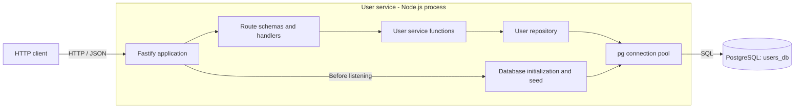
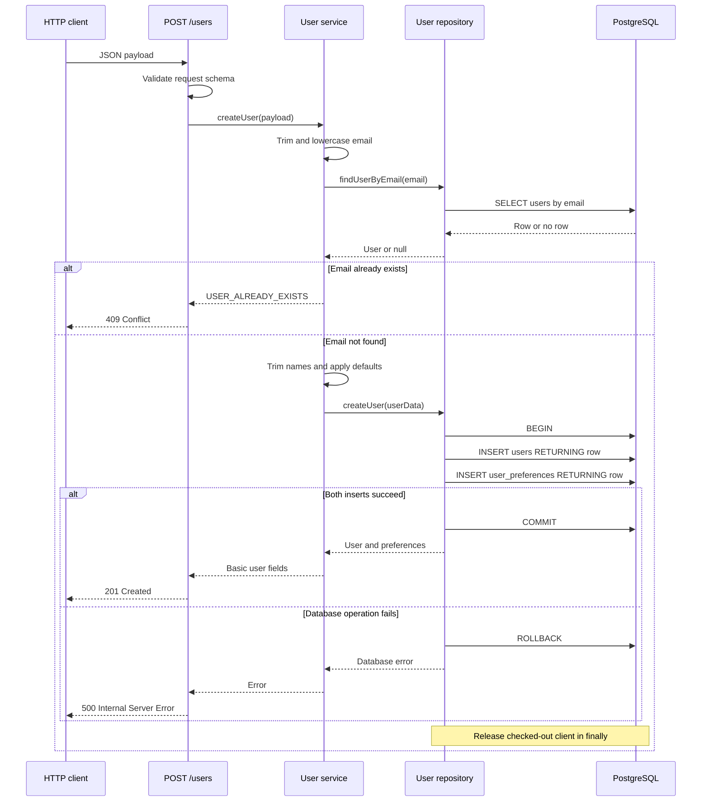
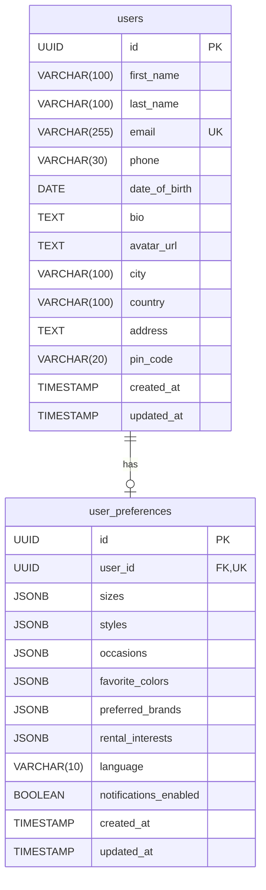

# User Service Architecture

This document describes the code currently implemented in `user-service`, as inspected on 2026-09-17. It covers this service alone. Other Outfit4Rent services, gateways, and UI integrations are not defined here.

## High-Level Architecture (HLA)

### Responsibility and boundary

The service owns user identity/profile records and rental preference records. It exposes three HTTP operations: create a user, find a user by email, and find a user by ID. All three return a basic user representation: `id`, `firstName`, `lastName`, `email`, and `createdAt`.

The runtime is a single Node.js process using Fastify and a PostgreSQL connection pool. There are no implemented outbound service calls, message queues, caches, background workers, or authentication integrations.

### Layers and infrastructure

| Component | Implemented responsibility | Source |
| --- | --- | --- |
| Application | Enable logging, register three route plugins, initialize the database, start HTTP listener. | [app.js](../app.js) |
| HTTP layer | Validate requests using route schemas; select HTTP status and response body; log handler errors. | [route/](../route/) |
| Service layer | Normalize input, apply defaults, check duplicate/missing users, return basic user fields. | [user-service.js](../service/user-service.js) |
| Repository layer | Execute parameterized SQL, map SQL column names to camelCase, create both records transactionally. | [user-repository.js](../repository/user-repository.js) |
| Database setup | Create pool, extension, tables, and demo data; log pool errors. | [database.js](../config/database.js) |
| Local infrastructure | PostgreSQL 17 on port `5432`, database `users_db`, named volume `postgres_data`. | [compose.yaml](../compose.yaml) |

Route handlers perform the controller role directly. The empty `controller/`, `model/`, and `utils/` directories do not add runtime layers. Tables are defined with SQL rather than an ORM.

### Startup and configuration

1. Import the database module, which constructs a `pg.Pool` with `process.env.DATABASE_URL`.
2. Create Fastify with `logger: true` and register the three route plugins.
3. Await `initDatabase()` before calling `fastify.listen()`.
4. Within one database transaction, create `uuid-ossp`, `users`, and `user_preferences` if absent, then insert demo records if absent.
5. Commit and release the client. On initialization failure, roll back, release, and rethrow.
6. Listen on `0.0.0.0` at `process.env.PORT || 3000`. Startup failures are logged and terminate the process with exit code `1`.

The npm start/dev commands load `.env` when present. `HOST` is not read by `app.js`. The root [config.js](../config.js) helper is never imported by the application; it references an undefined `integer()` function, so it is not a working alternate configuration path. Its default port `4001`, host, and database URL do not govern startup.

The demo seed uses email `demo@outfit4rent.com`, name `Demo User`, city `Essen`, and country `Germany`. Its preferences include sizes `L`/`XL`, styles `casual`/`formal`, occasions `wedding`/`business`, colors `black`/`blue`, brands `Zara`/`H&M`, and rental interests `jackets`/`suits`. Language is `en` and notifications are enabled.

Seeding runs on every startup without an environment guard. `ON CONFLICT ... DO NOTHING` preserves existing records. If the demo email already exists, its ID is selected for the preference insertion. Schema creation is bootstrap SQL, not a versioned migration system; existing table definitions are not upgraded by `CREATE TABLE IF NOT EXISTS`.

## Low-Level Design (LLD)

### Module interfaces

| Function | Behavior |
| --- | --- |
| Route plugin in `route/create-user.js` | Registers `POST /users`; calls service `createUser`; maps duplicate errors to `409`. |
| Route plugin in `route/get-user-by-email.js` | Registers `GET /users/email/:email`; calls service `getUserByEmail`; maps missing users to `404`. |
| Route plugin in `route/get-user-by-id.js` | Registers `GET /users/:userId`; calls service `getUserById`; maps missing users to `404`. Its exported function is currently misnamed `getUserByEmailRoute`. |
| Service `createUser(payload)` | Normalize email, query for duplicates, trim names, construct defaults, call repository creation, project five response fields. |
| Service `getUserByEmail(email)` | Trim/lowercase email, query repository, throw `USER_NOT_FOUND` if absent, project five fields. |
| Service `getUserById(id)` | Query repository without ID normalization, throw `USER_NOT_FOUND` if absent, project five fields. |
| Repository `findUserByEmail(email)` | Select user columns by exact email with `LIMIT 1`; return row or `null`. Does not load preferences. |
| Repository `findUserById(userId)` | Select user columns and a JSON preference object using `LEFT JOIN`; return row or `null`. |
| Repository `createUser(userData)` | Insert user and preferences with one checked-out client and transaction; return user columns plus preferences. |
| Repository `deleteUser(userId)` | Delete by ID, returning `{ id }` or `null`. No route or service function calls it. |

### Creation input and validation

Validation belongs to the Fastify route schema and occurs before the handler. Service normalization follows validation.

| Request field | Route constraint | Default applied by service when omitted |
| --- | --- | --- |
| `firstName`, `lastName` | Required strings, length 1–100 | None; trimmed before insertion |
| `email` | Required string, email format | None; trimmed and lowercased |
| `phone` | String, maximum 30 characters | `null` |
| `dateOfBirth` | String, date format | `null` |
| `profile` | Optional object | `{}` |
| `profile.bio` | String, maximum 500 characters | `null` |
| `profile.avatarUrl` | String, URI format | `null` |
| `profile.city`, `profile.country`, `profile.address`, `profile.pinCode` | Strings | `null` |
| `preferences` | Optional object | `{}` |
| `preferences.sizes`, `styles`, `occasions`, `favoriteColors`, `preferredBrands`, `rentalInterests` | Arrays of strings, each under `preferences` | `[]` for each |
| `preferences.language` | String | `en` |
| `preferences.notificationsEnabled` | Boolean; schema default `true` | `true` |

The root body schema sets `additionalProperties: false`; nested profile/preference schemas do not. With the installed Fastify defaults, undeclared root properties are removed. Service mapping persists only explicitly selected fields. Optional fields should be omitted when unused; the route schema does not explicitly declare nullable types.

The route does not enforce every database length limit: email is limited to 255 characters by the database, city/country to 100, pin code to 20, and language to 10. Such database failures reach the generic `500` handler. Names containing only whitespace can pass the length check and become empty strings after trimming. Email format validation precedes trimming, so normalization does not guarantee acceptance of an email padded with spaces.

### Create-user flow

The duplicate lookup is outside the insertion transaction. Concurrent requests can both pass it; the unique email constraint still prevents duplicate rows, but the resulting PostgreSQL uniqueness error is not translated to `USER_ALREADY_EXISTS`, so that request receives `500` instead of `409`.

The repository serializes preference arrays using `JSON.stringify()` and binds them as `$n::jsonb`. Both inserts use the same checked-out client. If preference insertion fails, the user insertion is rolled back too. Queries use positional parameters rather than interpolating request values into SQL.

### Lookup and deletion behavior

- **By email:** the route validates email format; the service normalizes it; the repository selects from `users`; the service returns five basic fields.
- **By ID:** the repository selects from `users` with a left join on `user_preferences.user_id`, constructing `preferences` with `jsonb_build_object`. The service discards the extra fields and returns the same five basic fields. If a user has no preference row, the repository's JSON object contains null preference values.
- **Missing user:** either lookup returns `null` from the repository and becomes `USER_NOT_FOUND` in the service, then HTTP `404`.
- **Deletion:** the repository can delete a user, and the foreign key cascades to preferences. This is an internal function only; no HTTP delete operation is implemented.

The ID route requires a `userId` parameter but mistakenly defines `properties.email` instead of `properties.userId`. It has no UUID format validation. A malformed UUID reaches PostgreSQL and produces the generic `500` response.

### Response contracts

| Result | HTTP status | Body |
| --- | --- | --- |
| User created | `201` | `{ "success": true, "message": "User created successfully", "data": <basic user> }` |
| User found by either lookup | `200` | `{ "data": <basic user> }` |
| Existing email detected by pre-check | `409` | `{ "success": false, "message": "A user with this email already exists" }` |
| User not found | `404` | `{ "success": false, "message": "User not found" }` |
| Unexpected creation failure | `500` | `{ "success": false, "message": "Unable to create user" }` |
| Unexpected lookup failure | `500` | `{ "success": false, "message": "Unable to find user" }` |
| Schema validation failure | `400` | Fastify error object with `statusCode`, `code`, `error`, and `message` |

`<basic user>` contains `id`, `firstName`, `lastName`, `email`, and `createdAt`. Dates are serialized as strings in JSON. Both GET routes currently declare their response schemas under `201` even though their handlers send `200`; those declared schemas do not describe the actual success status/envelope. There is no registered Swagger/OpenAPI plugin despite the route tags and summaries.

## Entity-Relationship Diagram (ERD)

The source of truth for both tables is [config/database.js](../config/database.js). Profile fields are columns on `users`; there is no separate profile table.

Each preference record belongs to exactly one user. A user can have **zero or one** preference record at the database level: `user_id` is non-null, unique, and references `users.id`, but no constraint requires every user to have preferences. The create-user transaction and demo seed both create a preference record for their user.

### `users` data dictionary

| Column | SQL type | Nullable | Default / constraint |
| --- | --- | --- | --- |
| `id` | `UUID` | No | Primary key; `uuid_generate_v4()` |
| `first_name` | `VARCHAR(100)` | No | No default |
| `last_name` | `VARCHAR(100)` | No | No default |
| `email` | `VARCHAR(255)` | No | Unique; no default |
| `phone` | `VARCHAR(30)` | Yes | No explicit default |
| `date_of_birth` | `DATE` | Yes | No explicit default |
| `bio` | `TEXT` | Yes | No explicit default |
| `avatar_url` | `TEXT` | Yes | No explicit default |
| `city` | `VARCHAR(100)` | Yes | No explicit default |
| `country` | `VARCHAR(100)` | Yes | No explicit default |
| `address` | `TEXT` | Yes | No explicit default |
| `pin_code` | `VARCHAR(20)` | Yes | No explicit default |
| `created_at` | `TIMESTAMP` | Yes | `CURRENT_TIMESTAMP` |
| `updated_at` | `TIMESTAMP` | Yes | `CURRENT_TIMESTAMP` |

### `user_preferences` data dictionary

| Column | SQL type | Nullable | Default / constraint |
| --- | --- | --- | --- |
| `id` | `UUID` | No | Primary key; `uuid_generate_v4()` |
| `user_id` | `UUID` | No | Unique; FK to `users.id`; `ON DELETE CASCADE` |
| `sizes` | `JSONB` | Yes | `'[]'::jsonb` |
| `styles` | `JSONB` | Yes | `'[]'::jsonb` |
| `occasions` | `JSONB` | Yes | `'[]'::jsonb` |
| `favorite_colors` | `JSONB` | Yes | `'[]'::jsonb` |
| `preferred_brands` | `JSONB` | Yes | `'[]'::jsonb` |
| `rental_interests` | `JSONB` | Yes | `'[]'::jsonb` |
| `language` | `VARCHAR(10)` | Yes | `'en'` |
| `notifications_enabled` | `BOOLEAN` | Yes | `TRUE` |
| `created_at` | `TIMESTAMP` | Yes | `CURRENT_TIMESTAMP` |
| `updated_at` | `TIMESTAMP` | Yes | `CURRENT_TIMESTAMP` |

### Integrity and storage details

- Primary keys and unique constraints supply indexes for user ID, email, preference ID, and preference user ID. No additional indexes are declared.
- Email normalization is implemented in the service, not in a database constraint or trigger. The schema uses ordinary `VARCHAR` uniqueness, not `CITEXT` or a unique index on `lower(email)`.
- JSONB columns have empty-array defaults but no SQL checks requiring arrays or string elements. The HTTP schema supplies those checks for API creation.
- Defaults do not imply `NOT NULL`; preference values and timestamps remain nullable in the schema.
- `TIMESTAMP` means timestamp without time zone. Both timestamp columns default on insertion; there is no trigger or update implementation that refreshes `updated_at`.
- Deleting a user removes its preferences through the foreign key. Removing preferences does not remove the user.

## Current operational scope and limitations

- Fastify request logging is enabled; route handlers log caught errors, and the database module logs pool and initialization errors.
- `@fastify/cors`, `@fastify/helmet`, and `jsonwebtoken` are dependencies but are not registered or used in the application. There is no implemented authentication, authorization, CORS configuration, or rate limiting.
- No health/readiness endpoint, graceful shutdown hook, explicit `pool.end()` on shutdown, database retry policy, or application container is implemented.
- There are no update, list, preference-management, password, login, or email-delivery endpoints. `smtp-server` is a development dependency without implemented usage in this service.
- There are no project test files, versioned migrations, or configured API documentation generator. The `npm test` command only invokes Node's test runner.

These are observations of the current implementation, not additional features implied by the diagrams.
